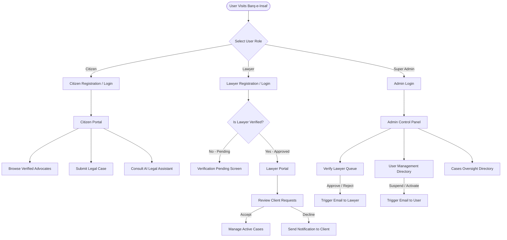
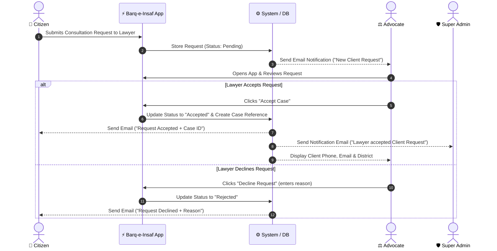
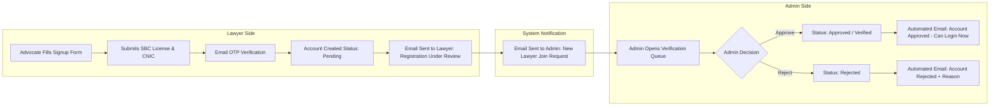
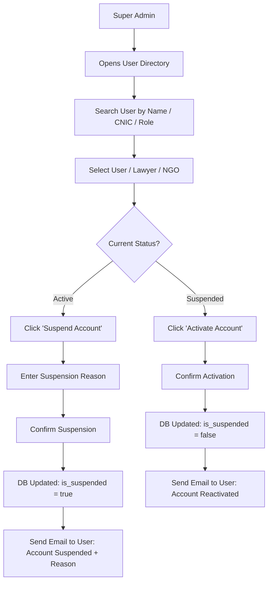

# ⚡ Barq-e-Insaf (برقِ انصاف)
## Platform Vision, User Features & Complete System Workflows

---

## 1. Core Purpose & Executive Vision

**Barq-e-Insaf** (Lightning of Justice) is Pakistan's premier digital legal empowerment platform, engineered specifically to streamline legal assistance, advocate verification, and case management across the districts of Sindh.

In traditional legal systems, citizens face significant barriers: finding genuine licensed advocates, understanding complex court procedures, and tracking consultation progress. **Barq-e-Insaf** eliminates these barriers by providing a transparent, secure, and user-centric platform where citizens, legal practitioners, and administrators interact seamlessly.

> [!NOTE]
> **Key Mission**: To ensure that every citizen in Sindh—regardless of location or socioeconomic status—has rapid, transparent access to verified legal representation and legal guidance.

---

## 2. What the Platform Offers to Each User Role

```
                                  ┌────────────────────────┐
                                  │   BARQ-E-INSAF SYSTEM  │
                                  └───────────┬────────────┘
                                              │
         ┌────────────────────────────────────┼────────────────────────────────────┐
         │                                    │                                    │
┌────────┴─────────┐                ┌─────────┴────────┐                 ┌─────────┴─────────┐
│     CITIZENS     │                │     LAWYERS      │                 │    ADMIN PANEL    │
│  (Legal Seekers) │                │  (Advocates)     │                 │   (Super Admin)   │
└──────────────────┘                └──────────────────┘                 └───────────────────┘
```

---

### 👥 A. For Citizens (Legal Assistance Seekers)

Citizens are the primary beneficiaries of the Barq-e-Insaf ecosystem. The platform provides a safe and easy-to-use digital portal:

1. **Simple Account Registration & Verification**:
   - Register using full name, email, mobile phone number, Sindh district, and CNIC number (`xxxxx-xxxxxxx-x`).
   - One-Time Password (OTP) security verification sent directly to email to ensure account authenticity.
   - Immediate welcome email upon account creation detailing how to get started.

2. **Advocate Directory & Discovery**:
   - Browse and search verified Sindh Bar Council advocates by district (Karachi, Hyderabad, Sukkur, Larkana, Mirpur Khas, etc.).
   - Filter advocates by legal specialization:
     - **Family Law** (Khula, Custody, Maintenance)
     - **Property & Land Disputes** (Encroachment, Inheritance, Title Transfer)
     - **Civil Litigation** (Contracts, Damages)
     - **Criminal Defense** (Bail, CrPC 497)
     - **Corporate & Tax Law**

3. **Consultation Requests**:
   - Send direct consultation requests to selected advocates detailing the legal problem.
   - Receive email notifications when an advocate accepts or declines the consultation request.

4. **Case Filing & Progress Tracking**:
   - Submit formal legal cases onto the platform.
   - Upload evidence, documents, and relevant court filings.
   - Track case status (Pending, Active, Completed) in real-time.

5. **24/7 AI Legal Assistant**:
   - Ask legal questions in Urdu, Sindhi, or English.
   - Receive instant legal guidance based on the Constitution of Pakistan (1973), Pakistan Penal Code (PPC), and Sindh Family/Property laws.

---

### ⚖️ B. For Lawyers / Advocates (Legal Practitioners)

Advocates on Barq-e-Insaf receive a professional digital chamber to expand their practice and manage client consultations efficiently:

1. **Professional Registration & SBC License Submission**:
   - Advocates register with their full credentials, Sindh Bar Council (SBC) license number, years of experience, primary district, and legal specialties.

2. **Mandatory Admin Verification Queue**:
   - Upon signup, the advocate's account is placed in **"Pending Verification"** status.
   - The advocate receives an email confirming their registration is under administrative review.
   - Advocates cannot access client consultation features until the Super Admin verifies their credentials.

3. **Consultation Request Management**:
   - Receive incoming consultation requests from citizens.
   - Review problem statements while keeping sensitive contact details secure.
   - **Accept Request**: Automatically generates a case reference, notifies the citizen via email, notifies the platform admin, and unlocks full client contact details.
   - **Decline Request**: Allows advocate to decline with an optional reason; citizen receives an instant notification email.

4. **Active Case Portfolio**:
   - Manage all accepted legal cases in one clean workspace.
   - Monitor scheduled court hearing dates, client notes, and case documents.

---

### 🛡️ C. For Platform Administration (Super Admin)

The Administration Panel gives platform managers complete real-time oversight of all platform operations without mock or dummy data:

1. **Real-Time Database Dashboard**:
   - Monitor platform-wide metrics: Total Registered Users, Verified Lawyers, Pending Verification Queue, Active Cases, and Flagged Cases.
   - Live activity feed showing recent signups and consultation request updates across Sindh.

2. **Lawyer Verification Queue**:
   - Review advocate registration applications.
   - Validate Sindh Bar Council (SBC) license numbers, CNIC details, and experience.
   - **Approve Advocate**: Activates the advocate's profile and triggers an automated Approval Email to the lawyer.
   - **Reject Application**: Rejects the application with a specific reason; triggers an automated Rejection Email to the lawyer.

3. **User Management & Account Suspension**:
   - View complete directory of all registered Citizens, Lawyers, NGOs, and Admin accounts.
   - Filter users by role or search by name, email, phone number, or CNIC.
   - **Suspend Account**: Suspend any user/advocate for policy violations by entering a reason. Triggers an automated Account Suspension Email to the user explaining the reason.
   - **Reactivate Account**: Re-enable suspended accounts when resolved; sends an Account Reactivation Email.

4. **Cases Oversight**:
   - Monitor all active legal cases across Sindh districts.
   - Track case category distribution, citizen involvement, and assigned advocates.

---

## 3. End-to-End Visual System Flowcharts

### 📊 Diagram 1: Overall Platform Architecture & User Journey Ecosystem



---

### 📩 Diagram 2: Legal Consultation & Case Request Flowchart



---

### ⏳ Diagram 3: Advocate Verification & Approval Workflow



---

### ⛔ Diagram 4: Admin Account Suspension Workflow



---

## 4. Key Email Notifications Matrix

| Event Trigger | Recipient | Email Subject Line | Purpose |
|---|---|---|---|
| Citizen Signup | Citizen | `Barq-e-Insaf - Khush Aamdeed! Aapka Account Ban Gaya` | Welcomes user & provides getting-started guidance |
| Lawyer Signup | Lawyer | `Barq-e-Insaf - Aapki Registration Review Ke Liye Bheji Gayi` | Confirms registration is pending admin approval |
| Lawyer Signup | Super Admin | `[Admin] Nayi Lawyer Join Request - {Name}` | Notifies admin to review SBC credentials |
| Admin Approves Lawyer | Lawyer | `Barq-e-Insaf - Aapki Registration Manzoor Ho Gayi` | Informs lawyer they can now log in and take clients |
| Admin Rejects Lawyer | Lawyer | `Barq-e-Insaf - Aapki Registration Manzoor Nahi Hui` | Explains rejection reason to lawyer |
| Citizen Requests Case | Lawyer | `Barq-e-Insaf - Nayi Client Request Aayi Hai` | Alert advocate to review incoming consultation |
| Lawyer Accepts Request | Citizen | `Barq-e-Insaf - Aapki Request Qabool Ho Gayi` | Confirms acceptance and shares Case ID |
| Lawyer Accepts Request | Super Admin | `[Admin] Request ACCEPTED: {Citizen} - {Lawyer}` | Keeps admin informed of legal pairings |
| Admin Suspends Account | User / Lawyer | `Barq-e-Insaf - Aapka Account Suspend Kar Diya Gaya Hai` | Details suspension reason & support contact |
| Admin Reactivates Account | User / Lawyer | `Barq-e-Insaf - Aapka Account Dobara Active Kar Diya Gaya Hai` | Notifies user that account access is restored |

---

## 5. Summary & System Quality Assurance

- **No Dummy / Hardcoded Data**: Every single screen (Admin Dashboard, User Directory, Verification Queue, Lawyer Requests, Cases) runs 100% on live database records.
- **Strict Role-Based Security**: Unapproved advocates cannot bypass the pending verification screen. Suspended accounts are immediately gated at login.
- **Spam-Optimized Email Delivery**: All email subject lines are free from spam-score triggers (emojis, unicode symbols) and include automatic plain-text fallbacks.
- **Cross-Platform Responsive UX**: Mobile and web interfaces feature intuitive navigation drawer sidebars and dialogs tailored for Pakistan's legal community.
